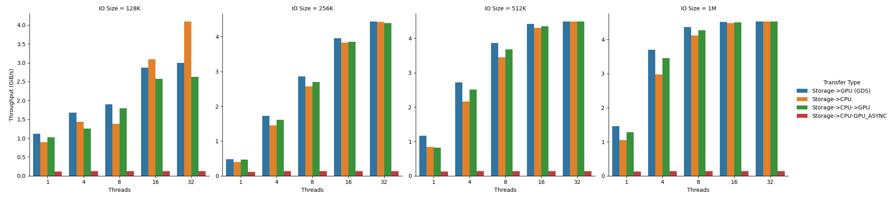
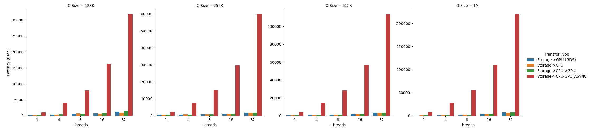

# Nvidia GPUDirect Storage (GDS)

This repository describes how to setup and benchmark NVIDIA GPUDirect Storage performance.

## Setup

### Mellanox OFED

Download and Reinstall Mellanox OFED (>= 5.3) before installing CUDA Toolkit.
```bash
# Check MLNX_OFED version
ofed_info -s

# if MLNX already installed, uninstall first
cd MLNX_OFED_LINUX-5.8-1.0.1.1-ubuntu20.04-x86_64
./uninstall.sh
```

```bash
# MLNX_OFED installation for GDS
./mlnxofedinstall --with-nvmf --with-nfsrdma --enable-gds --add-kernel-support
update-initramfs -u -k `uname -r`
/etc/init.d/openibd restart # if error[FAILED] on loading new modules, try as below
reboot 
```
```bash
# if no error[FAILED], skip here
rmmod {old_module} # if needed
/etc/init.d/openibd restart # try again
reboot
```

### CUDA Toolkit and Nvidia Driver
Install cuda toolkit with runfile. `nvidia-fs` (`nvidia-gds` package)  is supported from cuda 12.0 (or later) in runfile installation.

```bash
# if CUDA already installed, uninstall first
# uninstall cuda
sudo /usr/local/cuda-11.7/bin/cuda-uninstaller
# uninstall Nvidia driver 
sudo /usr/bin/nvidia-uninstall
```

```bash
# CUDA / Driver installation with GDS package
sudo sh cuda_12.0.0_525.60.13_linux.run --kernelobjects # 'nvidia-fs' kernel object should be installed
```

```bash
# After installation, make sure to include PATH and LD_LIBRARY_PATH
export PATH="/usr/local/cuda-12.0/bin:$PATH"
export LD_LIBRARY_PATH="/usr/local/cuda-12.0/lib64:$PATH"
```

### Check installation

```bash
lsmod | grep nvidia # this should print 'nvidia_fs ...'

export PATH="/usr/local/cuda-12.0/gds/tools:$PATH"
gdscheck -p # this should print 'NVMe : Supported'
```

```bash
# check your NVMe device
fdisk -l | grep nvme

# test run with 'gdsio' benchmarking utility
gdsio -f /dev/nvme0n1 -d 0 -w 4 -s 1G -i 1M -I 1 -x 0
```

### NVMeOF Setup for remote storage
- NVMe Server Configuration

    ```bash
    # Load kernel modules
    modprobe nvmet
    modprobe nvmet-rdma

    # Create a NVMe subsystem
    cd /sys/kernel/config/nvmet/subsystems
    mkdir nvme_subsystem # any name you want
    cd nvme_subsystem
    echo 1 > attr_allow_any_host

    # Create a namespace
    cd namespaces
    mkdir 1 # any number you want
    cd 1
    echo -n /dev/nvme0n1 > device_path
    echo 1 > enable

    # Create a port
    cd /sys/kernel/config/nvmet/ports
    mkdir 1 # any number you want
    cd 1
    echo X.X.X.X > addr_traddr # IP address on the Mellanox adapter (e.g., InfiniBand)
    echo rdma > addr_trtype
    echo 4420 > addr_trsvcid # 4420 is IANA default for NVMeOF
    echo ipv4 > addr_adrfam

    # Link subsystem to port
    ln -s /sys/kernel/config/nvmet/subsystems/nvme_subsystem /sys/kernel/config/nvmet/ports/1/subsystems/nvme_subsystem

    # Verify whether NVMe target is listening on the port
    dmesg | grep nvme # this should print 'nvmet_rdma: enabling port 1 (X.X.X.X:4420)'
    ```

- NVMeOF Client Configuration
    - Here we need to install [nvme-cli](https://github.com/linux-nvme/nvme-cli) for executing NVMe commands. Follow the nvme-cli repo install guide.

    ```bash
    # Load kernel modules
    modprobe nvme-rdma
    gdscheck -p # # this should print 'NVMeOF : Supported'
    
    # Discover available subsystems on NVMeOF target
    nvme discover -t rdma -a X.X.X.X -s 4420 # Same IP you have set on the NVMeOF Server
    
    # Connect to the discovered subsystem with the 'subnqn' name and IP you have set on the NVMeOF Server
    nvme connect -t rdma -n nvme_subsystem -a X.X.X.X -s 4420
    ```

    ```bash
    # If you want to disconnect from the target, run the following command
    nvme disconnect -d /dev/nvme0n1
    ```
    
For persistent setup, refer to [NVMeOF Configuration Docs](https://enterprise-support.nvidia.com/s/article/howto-configure-nvme-over-fabrics).

## Mounting a Local Filesystem for GDS
Currently, EXT4 and XFS are the only block device based filesystem that GDS supports.

```bash
# format with EXT4 file system which GDS supports
mkfs.ext4 /dev/nvme0n1

# the ext4 file system must be mounted with the journaling mode set to 'data=ordered'
mount -o data=ordered /dev/nvme0n1 /gds-files # any directory location you want to mount

# check mounted mode
mount | grep /dev/nvme0n1 # this should print '/dev/nvme0n1 on /gds-files type ext4 (rw,relatime,data=ordered)'
```


## Benchmarking GDS Performance

```bash
python gds_benchmark.py
```
### GDS Throughput Performance 


### GDS Latency Performance 


## Reference

- [NVIDIA GPUDirect Storage Docs](https://docs.nvidia.com/gpudirect-storage/index.html)

- [NVIDIA NVMeOF Configuration Docs](https://enterprise-support.nvidia.com/s/article/howto-configure-nvme-over-fabrics)
